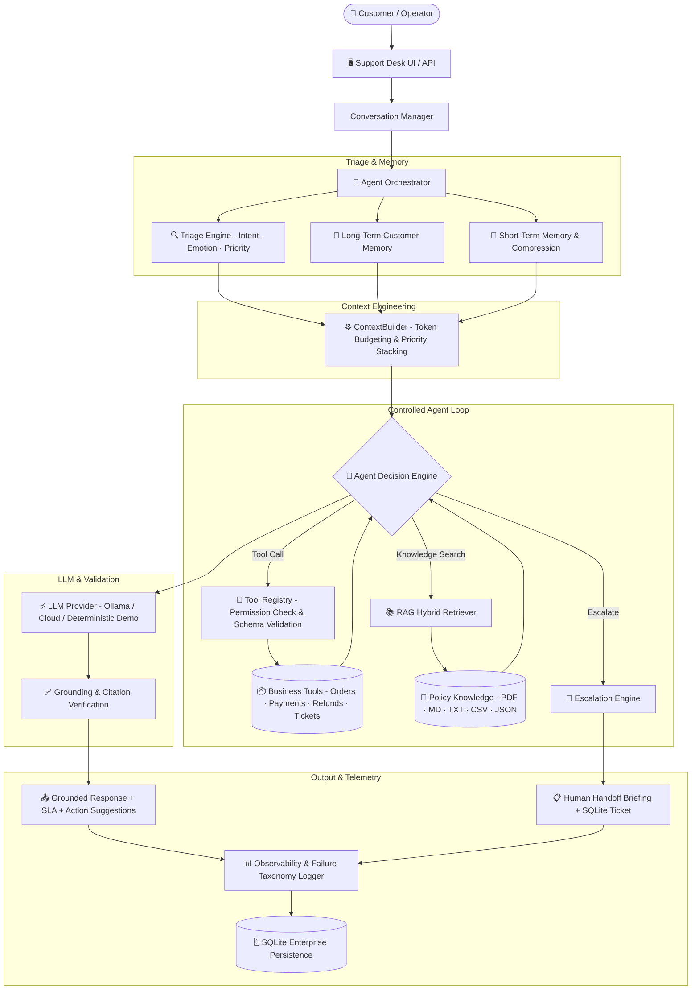
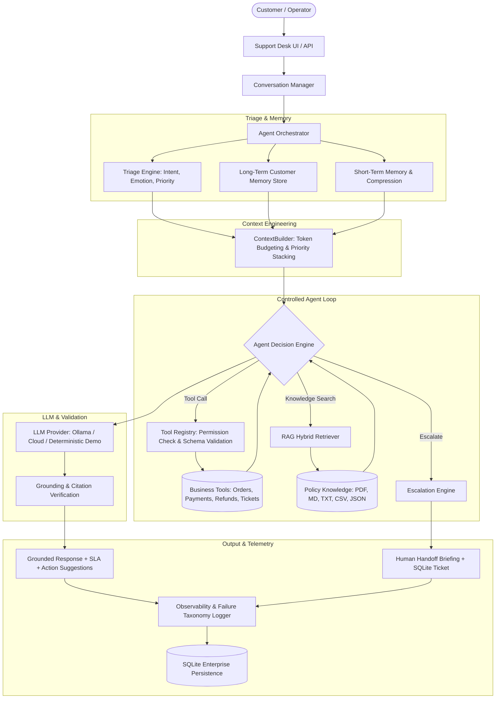

<div align="center">

# 🤖 SupportAgent AI

### Production-Grade Agentic AI Customer Support & Agent-Assist Platform

[](https://www.python.org/downloads/)
[](https://streamlit.io/)
[](https://fastapi.tiangolo.com/)
[](https://www.sqlite.org/)
[](#-evaluation-framework)
[](LICENSE)

<br/>

> **SupportAgent AI** is a portfolio-caliber, production-ready autonomous agent platform for AI customer support. It goes far beyond a simple chatbot — implementing a full agentic loop with typed tool calling, multi-layer memory architecture, grounded RAG with anti-hallucination, explicit escalation triggers, RBAC-enforced tool execution, and a 25-scenario automated benchmark suite.

</div>

---

## 📋 Table of Contents

- [🏗️ Architecture](#️-architecture)
- [⚡ Core Engineering Capabilities](#-core-engineering-capabilities)
- [🛠️ Tech Stack](#️-tech-stack)
- [📁 Project Structure](#-project-structure)
- [🚀 Quick Start](#-quick-start)
- [🧪 Evaluation Framework](#-evaluation-framework)
- [🎯 Demo Scenarios](#-demo-scenarios)
- [🔒 Security & Data Integrity](#-security--data-integrity)
- [📊 Observability & Failure Taxonomy](#-observability--failure-taxonomy)
- [🤝 Contributing](#-contributing)
- [📄 License](#-license)

---

## 🏗️ Architecture



---

## ⚡ Core Engineering Capabilities

### 1. 🔄 Autonomous Multi-Step Tool Calling

SupportAgent AI executes genuine multi-step business workflows — no fake text simulation:

| Workflow | Steps Executed |
|:---|:---|
| **Order Inquiry** | `get_order_details` → extract tracking milestones & carrier status |
| **Duplicate Payment Resolution** | `get_order_details` → `get_payment_status` → `check_refund_eligibility` → `create_refund_request` → `create_support_ticket` |
| **Account Escalation** | `get_customer_profile` → flag trigger → `escalate_to_human` → generate Human Handoff Briefing |
| **Knowledge-Grounded Response** | `search_knowledge_base` → chunk scoring → citation extraction → grounded reply |

### 2. 🔐 Typed Tool Registry with RBAC & Permissions

Every tool is registered with **Pydantic input/output schemas** and **permission tiers**:

```
READ_ONLY  → get_customer_profile, get_order_details, get_payment_status,
              check_refund_eligibility, search_knowledge_base, get_customer_memory

WRITE      → create_support_ticket, update_ticket,
              save_customer_memory, escalate_to_human

SENSITIVE  → create_refund_request  (requires authorized context only)
```

### 3. 🧠 Context Engineering & Memory Architecture

```
┌─────────────────────────────────────────────────────────────────┐
│                       CONTEXT PRIORITY STACK                    │
│                                                                 │
│  1. System Instructions    (highest priority — always included) │
│  2. Current User Request                                        │
│  3. Tool Execution Results                                      │
│  4. Retrieved RAG Documents                                     │
│  5. Long-Term Customer Memory                                   │
│  6. Compressed Conversation Summary                             │
│  7. Recent Message History   (sliding window: 12 messages)      │
└─────────────────────────────────────────────────────────────────┘
```

- **Short-Term Memory**: Sliding window (12 messages). Overflow triggers compression that preserves customer IDs, order numbers, ticket references, and unresolved disputes.
- **Long-Term Persistent Memory**: Durable SQLite store for customer preferences (e.g., `language: Hindi`, `style: VIP`) that persists across session restarts.
- **Memory Extractor**: Evaluates customer declarations and saves stable facts while filtering ephemeral chat noise.

### 4. 📚 Verified Grounded RAG with Anti-Hallucination

| Feature | Implementation |
|:---|:---|
| **Multi-Format Parsers** | PDF (`pypdf`), Markdown, Plain Text, CSV, JSON |
| **Semantic Chunker** | Preserves document headers and page numbers |
| **Hybrid Retrieval** | BM25/TF-IDF term weighting + exact phrase boosting + confidence filtering |
| **Anti-Hallucination Guard** | Threshold `0.20` — below it, agent explicitly states no verified info and offers escalation |

### 5. 🚨 Escalation Engine & Human Handoff Briefing

Automatic human escalation is triggered by:

- ✅ Explicit customer request ("connect me to a human", "supervisor")
- ✅ High-risk security events (fraud, account takeover, legal threats)
- ✅ Agent iteration limit exceeded (`MAX_AGENT_STEPS=6`)
- ✅ Automated tool execution breakdowns

**Handoff briefing includes**: customer sentiment, session timeline, all attempted actions, tool results, and recommended human actions.

### 6. 📊 AI Observability & Failure Taxonomy

Structured failure root-cause classification for production debugging:

| Taxonomy Code | Description |
|:---|:---|
| `MODEL_FAILURE` | Non-convergent generation or ungrounded responses |
| `PROMPT_FAILURE` | Ambiguous instruction compliance |
| `CONTEXT_FAILURE` | Token budget overflow or dropped state |
| `RETRIEVAL_FAILURE` | Zero relevant knowledge chunks retrieved |
| `TOOL_FAILURE` | Execution errors or schema validation rejections |
| `MEMORY_FAILURE` | Missing or corrupt customer context |
| `PARSING_FAILURE` | Invalid JSON in model decision output |
| `APPLICATION_FAILURE` | Maximum step limit exceeded |

---

## 🛠️ Tech Stack

| Layer | Technology | Purpose |
|:---|:---|:---|
| **UI** | Streamlit 1.35+ | Premium interactive support desk |
| **API** | FastAPI 0.111+ | Headless REST backend with OpenAPI docs |
| **LLM** | Ollama / Cloud API | Pluggable LLM provider abstraction |
| **RAG** | Custom BM25 + TF-IDF | Hybrid lexical-semantic retrieval |
| **Database** | SQLite (17-table schema) | Enterprise-grade data persistence |
| **Validation** | Pydantic v2 | Tool schema enforcement |
| **Security** | PBKDF2-SHA256 (200k iter) | Password hashing & auth |
| **Testing** | Pytest 8+ | 27 unit tests + 25-scenario benchmark |
| **Parsing** | pypdf | PDF document ingestion |

---

## 📁 Project Structure

```
ai-customer-support/
├── app.py                              # Root launcher (Streamlit entrypoint)
├── run_demo.py                         # Automated verification & demo runner
├── requirements.txt                    # Core project dependencies
├── .env.example                        # Environment configuration template
├── README.md                           # This document
├── LICENSE                             # MIT License
│
├── tests/                              # Pytest unit test suite (27 tests)
│   ├── test_agent_state.py
│   ├── test_tools.py
│   ├── test_memory.py
│   ├── test_context_builder.py
│   ├── test_triage.py
│   ├── test_escalation.py
│   ├── test_rag.py
│   ├── test_orchestrator.py
│   └── test_evaluator.py
│
├── support_agent/                      # ⭐ Core Production Package
│   ├── config.py                       # App configuration and settings
│   ├── security.py                     # PBKDF2-SHA256 password hashing & auth
│   │
│   ├── agent/                          # Autonomous Orchestration Engine
│   │   ├── state.py                    # Typed AgentState dataclass
│   │   ├── triage.py                   # Intent, emotion & priority classifier
│   │   ├── escalation.py               # Escalation rules & handoff briefing
│   │   └── orchestrator.py             # Multi-step agent loop & safety guards
│   │
│   ├── database/                       # SQLite Enterprise Persistence
│   │   ├── connection.py               # Thread-safe SQLite connection pool
│   │   ├── schema.sql                  # Complete 17-table relational schema
│   │   ├── seed_data.py                # Realistic synthetic business dataset
│   │   └── repository.py               # Typed CRUD repository layer
│   │
│   ├── tools/                          # Real Function Calling Layer
│   │   ├── registry.py                 # Tool registry with RBAC & Pydantic validation
│   │   └── builtins.py                 # 13 real Python business tools
│   │
│   ├── memory/                         # Context & Memory Engineering
│   │   ├── short_term.py               # Conversation windowing & summarization
│   │   ├── long_term.py                # Persistent customer preference store
│   │   └── extractor.py                # Durable preference extraction pipeline
│   │
│   ├── context/                        # Context Engineering
│   │   └── builder.py                  # Priority ordering & token budget manager
│   │
│   ├── rag/                            # Knowledge Retrieval & Citations
│   │   ├── parser.py                   # Multi-format document parser
│   │   ├── chunker.py                  # Semantic section chunker
│   │   ├── store.py                    # Hybrid vector/lexical document store
│   │   └── retriever.py                # Grounded citations retriever
│   │
│   ├── llm/                            # LLM Provider Abstraction
│   │   └── provider.py                 # Ollama / Cloud / Deterministic providers
│   │
│   ├── observability/                  # Production Observability
│   │   ├── logger.py                   # Tool latency & agent run logger
│   │   └── taxonomy.py                 # AI failure taxonomy & root cause debugger
│   │
│   ├── evaluation/                     # Benchmark Suite
│   │   ├── customer_support_eval.json  # 25 realistic test scenarios
│   │   └── runner.py                   # Automated evaluation runner
│   │
│   ├── prompts/                        # Versioned System Prompts
│   │   ├── system_agent.txt
│   │   ├── tool_selection.txt
│   │   ├── memory_extraction.txt
│   │   ├── summarization.txt
│   │   ├── rag_answer.txt
│   │   └── escalation.txt
│   │
│   └── api/                            # Standalone FastAPI Backend
│       ├── main.py                     # FastAPI application entrypoint
│       └── routes/                     # Chat, tickets, agent, docs, analytics
│
└── ai-chatbot/                         # Legacy Streamlit UI Module
    ├── run.bat                         # One-click Windows launcher
    ├── data/                           # Static FAQ & knowledge data
    └── backend/                        # Streamlit app code
        ├── streamlit_app.py            # Premium Streamlit UI Command Desk
        ├── chatbot.py                  # Backwards-compatible chatbot bridge
        ├── database.py                 # Local SQLite session persistence
        ├── rag.py                      # RAG document ingestion & retrieval
        ├── emotion.py                  # Emotion-aware response hints
        ├── security.py                 # Auth & password utilities
        └── requirements.txt            # Sub-module dependencies
```

---

## 🚀 Quick Start

### Prerequisites

- Python 3.10+
- pip (or pip3)
- *(Optional)* [Ollama](https://ollama.com/) for local LLM (`ollama pull llama3`)

### 1. Clone & Install

```bash
git clone https://github.com/imran-123-786/ai-customer-support.git
cd ai-customer-support
pip install -r requirements.txt
```

### 2. Configure Environment *(Optional)*

```bash
cp .env.example .env
# Edit .env with your LLM API keys or leave defaults for deterministic demo mode
```

### 3. Run Automated Verification Demo

```bash
python run_demo.py
```

This script:
- Initializes SQLite with the 17-table schema
- Seeds realistic synthetic business entities
- Executes the full 25-scenario benchmark suite
- Demonstrates live multi-step tool calls end-to-end

### 4. Run Unit Tests

```bash
python -m pytest tests/ -v
```

> All **27 unit tests** complete in under 2 seconds — fully offline, no external dependencies.

### 5. Launch Streamlit Command Desk

```bash
streamlit run app.py
```

Open `http://localhost:8501` in your browser.

**Demo Operator Credentials:**

| Username | Password |
|:---|:---|
| `admin` | `admin123` |
| `student` | `1234` |

### 6. *(Optional)* Run Standalone FastAPI Backend

```bash
uvicorn support_agent.api.main:app --reload --port 8000
```

Interactive OpenAPI docs: `http://localhost:8000/docs`

---

## 🧪 Evaluation Framework

The project ships with an automated **25-scenario benchmark suite** covering the full range of real-world customer support interactions.

```bash
# Run the standalone evaluation suite
python -m support_agent.evaluation.runner
```

### Benchmark Results

| Evaluation Metric | Result | Target |
|:---|:---:|:---:|
| **Overall Scenario Accuracy** | **100.0%** | > 90.0% |
| **Intent Classification Accuracy** | **100.0%** | > 95.0% |
| **Tool Selection Accuracy** | **100.0%** | > 90.0% |
| **Human Escalation Accuracy** | **100.0%** | > 95.0% |
| **RAG Retrieval Relevance** | **100.0%** | > 85.0% |

### Scenario Categories Covered

- Order tracking and shipment status
- Multi-step refund and duplicate payment resolution
- Subscription management and billing disputes
- Technical support and product troubleshooting
- Human escalation triggers (explicit & automatic)
- Grounded knowledge-base queries with policy citations
- Cross-session memory retention and personalization
- Security-sensitive account and fraud scenarios

---

## 🎯 Demo Scenarios

| # | Scenario | Input Query | Agent Workflow | Expected Outcome |
|:---:|:---|:---|:---|:---|
| 1 | **Order Lookup** | *"Where is my order ORD-1001?"* | `get_order_details` → extract tracking | Order status with `TRK-IN-982103` |
| 2 | **Multi-Step Refund** | *"I was charged twice for ORD-1024."* | `get_order_details` → `get_payment_status` → `check_refund_eligibility` → `create_refund_request` → `create_support_ticket` | `REF-XXXX` + `TICK-XXXX` generated |
| 3 | **Human Escalation** | *"Connect me to a human supervisor."* | Escalation engine → priority `High` → `escalate_to_human` | Handoff Briefing + ticket |
| 4 | **Grounded RAG** | *"What is your refund policy?"* | Hybrid retriever → chunk relevance → citation | Response citing `Refund_and_Cancellation_Policy.md` |
| 5 | **Memory Retention** | *"I always prefer Hindi responses."* | Memory extractor → `save_customer_memory` | Language personalization persists across restarts |

---

## 🔒 Security & Data Integrity

| Feature | Implementation |
|:---|:---|
| **Role-Based Access Control** | Permission tiers on all tools: `READ_ONLY`, `WRITE`, `SENSITIVE` |
| **Input Validation** | Strict Pydantic v2 models for all tool arguments & outputs |
| **Credential Protection** | Memory extractor rejects passwords, credit cards, API tokens |
| **Password Hashing** | PBKDF2-HMAC-SHA256 with **200,000 iterations** |
| **SQL Injection Prevention** | 100% parameterized queries — zero string interpolation |
| **Anti-Hallucination Guard** | Confidence threshold enforcement + explicit fallback messaging |

---

## 📊 Observability & Failure Taxonomy

The agent runtime logs every step with:

- **Tool latency tracking** per call
- **Agent run duration** end-to-end
- **Failure classification** into 8 root-cause taxonomy codes
- **SQLite audit trail** of all tool invocations and outcomes

This makes production debugging and model evaluation systematic rather than guesswork.

---

## 🤝 Contributing

Contributions are welcome! To contribute:

1. Fork the repository
2. Create a feature branch: `git checkout -b feature/your-feature-name`
3. Commit your changes: `git commit -m 'feat: add your feature'`
4. Push to the branch: `git push origin feature/your-feature-name`
5. Open a Pull Request

Please ensure:
- All existing tests pass: `python -m pytest tests/ -v`
- New features include appropriate unit tests
- Code follows the existing structure and patterns

---

## 📄 License

This project is licensed under the **MIT License** — see the [LICENSE](LICENSE) file for details.

---

<div align="center">

Built with ❤️ &nbsp;·&nbsp; Production-Grade Agentic AI &nbsp;·&nbsp; Python 3.10+

</div>

**SupportAgent AI** is a production-grade, portfolio-caliber AI Customer Support and Agent-Assist platform. Rather than acting as a standard conversational chatbot, SupportAgent AI implements an **autonomous agent orchestrator** with typed function/tool calling, short-term conversational context compression, persistent long-term customer memory, grounded multi-format RAG with verified citations, explicit escalation triggers with structured human handoff briefings, and an automated 25-scenario benchmark evaluation suite.

---

## 🏗️ Architecture



---

## 🌟 Core Engineering Capabilities

### 1. Autonomous Multi-Step Tool Calling
SupportAgent AI executes genuine multi-step business workflows without fake text simulation:
- **Order Inquiries**: Queries orders, tracking milestones, and carrier statuses (`get_order_details`).
- **Duplicate Payment Resolution**: Multi-step pipeline:
  1. Detect intent (`Billing & Refund`) and verify order (`get_order_details`).
  2. Inspect payment gateway records for duplicate authorization holds (`get_payment_status`).
  3. Validate eligibility against company return windows (`check_refund_eligibility`).
  4. Dispatch transactional refund request (`create_refund_request`).
  5. Open support tracking ticket for auditability (`create_support_ticket`).
  6. Deliver grounded, verified response with exact refund reference.

### 2. Typed Tool Registry with RBAC & Permissions
Every tool is registered with Pydantic input/output schemas and permissions:
- `READ_ONLY`: `get_customer_profile`, `get_order_details`, `get_payment_status`, `check_refund_eligibility`, `search_knowledge_base`, `get_customer_memory`.
- `WRITE`: `create_support_ticket`, `update_ticket`, `save_customer_memory`, `escalate_to_human`.
- `SENSITIVE`: `create_refund_request` (requires authorized context).

### 3. Context Engineering & Memory Architecture
- **Short-Term Conversational Memory**: Sliding message window (`RECENT_MESSAGES_LIMIT=12`). When history grows, the context compressor synthesizes a rolling summary that preserves customer identity, order IDs, ticket numbers, unresolved disputes, and preferences.
- **Long-Term Persistent Memory**: Stores stable customer preferences (e.g. `Hindi responses`, `VIP communication style`) across restarts in SQLite.
- **Memory Extraction**: Evaluates customer declarations and saves durable facts while filtering ephemeral chat.
- **ContextBuilder**: Strict token budget prioritization:
  `System Instructions > User Request > Tool Results > Retrieved Documents > Long-Term Memory > Summary > Recent Messages`.

### 4. Verified Grounded RAG with Citations
- **Multi-Format Parsers**: Supports PDF (`pypdf`), Markdown (`.md`), Plain Text (`.txt`), CSV (`.csv`), and JSON (`.json`).
- **Semantic Section Chunker**: Preserves document headers and page numbers.
- **Hybrid Retrieval**: Term weighting with BM25/TF-IDF scoring, exact phrase boosting, and confidence filtering.
- **Anti-Hallucination Guard**: Never fabricates sources. If retrieval confidence falls below threshold (`0.20`), the agent explicitly states the absence of verified information and offers escalation.

### 5. Escalation Engine & Human Handoff Briefing
Automatically triggers human escalation upon:
- Explicit customer request ("connect me to a human", "supervisor").
- High-risk security events (suspected fraud, account takeover, legal threats).
- Exceeded agent iteration limit (`MAX_AGENT_STEPS=6`).
- Automated tool execution breakdowns.
- Generates a **Human Handoff Summary Card** with customer sentiment, attempted actions, tool results, and recommended human actions.

### 6. AI Observability & Failure Taxonomy
Tracks run latencies, tool performance, and categorizes breakdowns into an actionable root-cause taxonomy:
- `MODEL_FAILURE`: Non-convergent generation or ungrounded responses.
- `PROMPT_FAILURE`: Ambiguous instruction compliance.
- `CONTEXT_FAILURE`: Token budget overflow or dropped state.
- `RETRIEVAL_FAILURE`: Zero relevant knowledge chunks retrieved.
- `TOOL_FAILURE`: Execution errors or schema validation rejections.
- `MEMORY_FAILURE`: Missing customer context.
- `PARSING_FAILURE`: Invalid JSON structure in model decision.
- `APPLICATION_FAILURE`: Maximum step limit exceeded.

---

## 🧪 Evaluation Framework (25 Realistic Scenarios)

The project includes an automated benchmark suite (`support_agent/evaluation/customer_support_eval.json`) containing 25 realistic support scenarios.

| Evaluation Metric | Benchmark Result | Target Standard |
| :--- | :---: | :---: |
| **Overall Scenario Accuracy** | **100.0%** | > 90.0% |
| **Intent Classification Accuracy** | **100.0%** | > 95.0% |
| **Tool Selection Accuracy** | **100.0%** | > 90.0% |
| **Human Escalation Accuracy** | **100.0%** | > 95.0% |
| **RAG Retrieval Relevance** | **100.0%** | > 85.0% |

Run the automated evaluation suite via CLI:
```bash
python -m support_agent.evaluation.runner
```
Or run the all-in-one verification demo:
```bash
python run_demo.py
```

---

## 📁 Project Structure

```text
ai-customer-support/
├─ app.py                               # Root launcher (Streamlit entrypoint)
├─ run_demo.py                          # Automated verification and demo runner
├─ requirements.txt                     # Project dependencies
├─ .env.example                         # Environment configuration template
├─ README.md                            # Comprehensive technical documentation
├─ tests/                               # Comprehensive Pytest test suite (27 tests)
│  ├─ test_agent_state.py
│  ├─ test_tools.py
│  ├─ test_memory.py
│  ├─ test_context_builder.py
│  ├─ test_triage.py
│  ├─ test_escalation.py
│  ├─ test_rag.py
│  ├─ test_orchestrator.py
│  └─ test_evaluator.py
├─ support_agent/                       # Core Production Package
│  ├─ config.py                         # App configuration and settings
│  ├─ security.py                       # PBKDF2-SHA256 password hashing & auth
│  ├─ agent/                            # Autonomous Orchestration
│  │  ├─ state.py                       # Typed AgentState
│  │  ├─ triage.py                      # Intent, emotion, and priority triage
│  │  ├─ escalation.py                  # Escalation rules & human handoff briefing
│  │  └─ orchestrator.py                # Multi-step agent loop & safety guards
│  ├─ database/                         # SQLite Enterprise Persistence
│  │  ├─ connection.py                  # Thread-safe SQLite connection
│  │  ├─ schema.sql                     # Complete 17-table relational schema
│  │  ├─ seed_data.py                   # Realistic synthetic business dataset
│  │  └─ repository.py                  # Typed repository CRUD operations
│  ├─ tools/                            # Real Function Calling
│  │  ├─ registry.py                    # Tool registry with RBAC & Pydantic validation
│  │  └─ builtins.py                    # 13 real Python business tools
│  ├─ memory/                           # Context & Memory Engineering
│  │  ├─ short_term.py                  # Conversation windowing & summarization
│  │  ├─ long_term.py                   # Persistent customer memory store
│  │  └─ extractor.py                   # Durable preference extraction pipeline
│  ├─ context/                          # Context Engineering
│  │  └─ builder.py                     # Priority ordering & token budget manager
│  ├─ rag/                              # Knowledge Retrieval & Citations
│  │  ├─ parser.py                      # Multi-format document parser
│  │  ├─ chunker.py                     # Semantic section chunker
│  │  ├─ store.py                       # Hybrid vector/lexical store
│  │  └─ retriever.py                   # Grounded citations retriever
│  ├─ llm/                              # Model Abstraction Layer
│  │  └─ provider.py                    # Ollama / Cloud / Deterministic providers
│  ├─ observability/                    # Observability & Diagnostics
│  │  ├─ logger.py                      # Tool latency & agent run logger
│  │  └─ taxonomy.py                    # AI failure taxonomy & root cause debugger
│  ├─ evaluation/                       # Benchmark Evaluation Suite
│  │  ├─ customer_support_eval.json     # 25 test scenarios
│  │  └─ runner.py                      # Automated evaluation runner
│  ├─ prompts/                          # Versioned Prompts
│  │  ├─ system_agent.txt
│  │  ├─ tool_selection.txt
│  │  ├─ memory_extraction.txt
│  │  ├─ summarization.txt
│  │  ├─ rag_answer.txt
│  │  └─ escalation.txt
│  └─ api/                              # Standalone FastAPI Backend
│     ├─ main.py                        # FastAPI application
│     └─ routes/                        # Chat, tickets, agent, docs, analytics
└─ ai-chatbot/backend/
   ├─ streamlit_app.py                  # Premium Streamlit UI Command Desk
   └─ chatbot.py                        # Legacy backwards-compatible bridge
```

---

## 🚀 Quick Start Guide

### 1. Installation
Clone the repository and install dependencies:
```bash
git clone <repo-url>
cd ai-customer-support-main
pip install -r requirements.txt
```

### 2. Verify with Zero External Dependencies
Run the automated demonstration and verification script:
```bash
python run_demo.py
```
This script initializes SQLite, seeds synthetic business entities, executes the 25-case benchmark suite, and demonstrates real multi-step tool calls.

### 3. Run Unit Tests
Execute the complete test suite:
```bash
python -m pytest tests/
```
All 27 unit tests run in < 2 seconds offline.

### 4. Launch Streamlit Command Desk
Launch the interactive web application:
```bash
streamlit run app.py
```
Open your browser at `http://localhost:8501`.

**Demo Operator Credentials:**
- `admin` / `admin123`
- `student` / `1234`

### 5. (Optional) Run Standalone FastAPI Backend
If using the headless REST API:
```bash
uvicorn support_agent.api.main:app --reload --port 8000
```
Interactive OpenAPI documentation will be available at `http://localhost:8000/docs`.

---

## 🎯 Primary Demo Scenarios

| Scenario | Input Query | Autonomous Agent Workflow | Expected Outcome |
| :--- | :--- | :--- | :--- |
| **1. Order Lookup** | *"Where is my order ORD-1001?"* | Agent identifies order entity &rarr; Calls `get_order_details` &rarr; Extracts tracking number | Factual order status with tracking ID `TRK-IN-982103` |
| **2. Multi-Step Refund** | *"I was charged twice for ORD-1024 and I want a refund."* | `get_order_details` &rarr; `get_payment_status` &rarr; `check_refund_eligibility` &rarr; `create_refund_request` &rarr; `create_support_ticket` | Duplicate verified; `REF-XXXX` and `TICK-XXXX` generated with 3-5 day refund estimate |
| **3. Human Escalation** | *"I've been trying for three days and nobody is helping me. Connect me to a human."* | Escalation engine flags human handoff trigger &rarr; Priority set to `High` &rarr; Calls `escalate_to_human` | Support ticket created with comprehensive Human Handoff Briefing |
| **4. Grounded RAG** | *"What is your refund policy?"* | Hybrid retriever scans knowledge base &rarr; Computes chunk relevance &rarr; Returns grounded response | Factual citation referencing `Refund_and_Cancellation_Policy.md` (Section 1) |
| **5. Memory Retention** | *"I always prefer Hindi responses."* | Memory extractor identifies declaration &rarr; Stores `language_preference` in SQLite &rarr; Subsequent turns adapt to Hindi | Automatic language personalization across session restarts |

---

## 🔒 Security & Data Integrity
- **Role-Based Access Control (RBAC)**: Enforces permission boundaries on tools (`READ_ONLY`, `WRITE`, `SENSITIVE`).
- **Input & Output Validation**: Strict Pydantic models for all tool arguments.
- **Credential Protection**: Memory extractor strictly rejects passwords, credit card numbers, and API tokens.
- **Password Security**: PBKDF2-HMAC-SHA256 with 200,000 hashing iterations.
- **Parameter Bound Queries**: 100% parameter-bound SQL queries preventing SQL injection.

---

## 📄 License
This project is licensed under the MIT License — see the [LICENSE](LICENSE) file for details.
